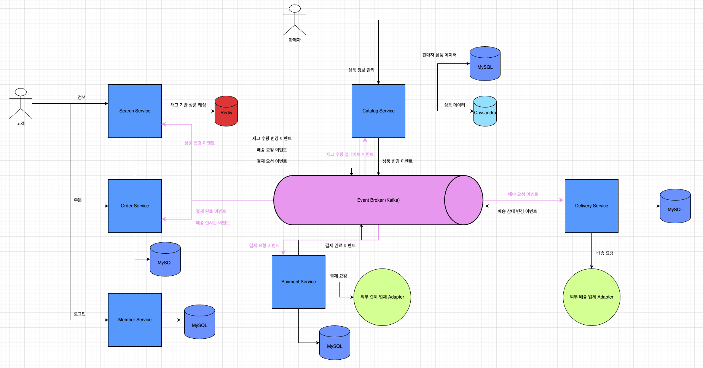

# PJ4. EDA 기반 블랙프라이데이 서비스

블랙프라이데이와 같은 급격한 사용자 트래픽을 처리할 수 있는 아키텍처 설계 및 구현

---

## 📌 프로젝트 목적

- EDA 기반으로 비동기 이벤트 처리 및 마이크로서비스 아키텍처 설계
- 블랙프라이데이와 같은 급격한 사용자 몰림 현상을 처리할 수 있는 아키텍처 설계
- 상품 주문 + 상품 주문 완료가 하나의 트랜잭션으로 TPS 1000 이상을 목표
- E-Commerce 시스템 구현
- Redis, Kafka, Cassandra 집중 탐구 프로젝트

---

## 🧰 기술 스택

| 항목     | 내용                                                                                                                                                             |
|--------|----------------------------------------------------------------------------------------------------------------------------------------------------------------|
| 언어     | Java 21                                                                                                                                                        |
| 빌드 도구  | Gradle (Build, Multi Module)                                                                                                                                   |
| 개발     | Spring Boot 3.4.4, Spring Kafka 3.3.5, Spring Data Cassandra 3.4.5, Spring Data JPA 3.4.5, Spring MVC 6.2.5, Docker (Redis, MySQL, Kafka, Cassandra, Services) |
| 데이터    | Redis 7.4, MySQL 8.0.38, Cassandra 4.18.1                                                                                                                      |
| 성능 테스트 | JMeter                                                                                                                                                         |

---

## 📈 주요 기능

| 컴포넌트         | 기능 항목     | 상태 |
|--------------|-----------|----|
| **Catalog**  | 상품 등록     | ✅  |
|              | 상품 삭제     | ✅  |
|              | 상품 조회     | ✅  |
|              | 상품 재고 수정  | ✅  |
| **Delivery** | 회원 배송지 등록 | ✅  |
|              | 배송        | ✅  |
|              | 배송 조회     | ✅  |
|              | 회원 배송지 조회 | ✅  |
|              | 배송 처리     | ✅  |
| **Member**   | 회원 등록     | ✅  |
|              | 회원 수정     | ✅  |
|              | 회원 조회     | ✅  |
|              | 로그인       | ✅  |
| **Order**    | 주문        | ✅  |
|              | 주문 조회     | ✅  |
| **Payment**  | 결제        | ✅  |
|              | 결제 처리     | ✅  |
|              | 결제 수단 등록  | ✅  |
|              | 결제 조회     | ✅  |
| **Search**   | 상품 조회     | ✅  |
|              | 상품 캐싱     | ✅  |

---

## 🏛️ Architecture

---

## 🏛️ Performance Testing

| 지표                            | 수치     | 비고            |
|-------------------------------|--------|---------------|
| **Number of Threads (Users)** | 500    | Infinite Loop |
| **Ramp-up**                   | 30     |               |
| **Samples**                   | 42251  |               |
| **TPS**                       | 1295.8 |               |
| **Average**                   | 203 ms |               |
| **Max**                       | 2 sec  |               |
| **Min**                       | 4 ms   |               |

---